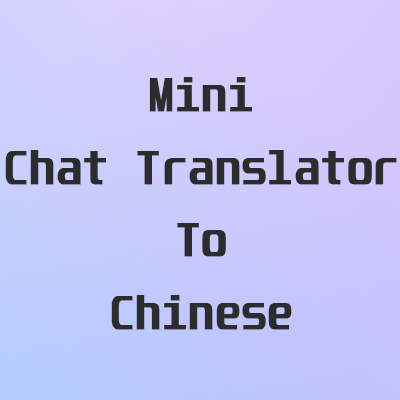

<div align="center">
  
  <h1>Universal Chat Translator</h1>
  <p>适用于 Minecraft 1.21.11 Fabric 客户端的通用聊天翻译 Mod</p>

  [English](README_EN.md) · 简体中文

  [](https://github.com/gawlashearin-blip/universal-chat-translator/actions/workflows/build.yml)
  [](https://github.com/gawlashearin-blip/universal-chat-translator/releases/latest)
  [](https://www.minecraft.net/)
  [](https://fabricmc.net/)
  [](LICENSE)
</div>

Universal Chat Translator 可以把收到的外语玩家消息或系统消息翻译成简体中文，也可以在发送前把中文聊天翻译成英文。默认使用无需配置的 Google 免费翻译，同时支持任意实现 OpenAI `POST /chat/completions` 协议的远程或本地服务。

> 本项目是基于 Real_SShwer 的 [Mini Chat Translator](https://github.com/ZHENXUWEI/mini-chat-translator-fabric) 修改的非官方衍生版本，与原作者无隶属或背书关系。完整说明见 [NOTICE.md](NOTICE.md)。

## 功能

- 分别控制玩家消息和系统消息；动作栏消息始终忽略。
- 识别原生玩家资料及常见插件格式，包括等级、图标、称号和 VIP 前缀。
- 玩家译文显示为 `[玩家名] 译文`，系统译文显示为 `[系统] 译文`。
- 用户名标签固定为金色；译文可选择 Minecraft 16 种标准颜色，默认浅蓝色。
- 中文发言成功时，本地显示 `[自己的用户名] 中文原文`，服务器正常显示英文译文。
- 跳过自己的原生 UUID 回显，并抑制插件系统通道中的近期自发消息。
- 翻译请求保持并发，但收件和发件分别严格按照原始顺序释放。
- 支持 Google 免费翻译和自定义 OpenAI 兼容接口，不在失败后自动转发给另一个供应商。
- 提供连接测试、系统提示词占位符、请求超时和 Temperature 设置。
- 提供四个可选单键快捷键；默认全部未绑定。

### 聊天效果

收到消息：

```text
1⚒ Steve: where are you
[Steve] 你在哪里
```

发送中文：

```text
[YourName] 大家好
<YourName> Hello everyone
```

第一行只在本地显示；第二行由服务器按正常聊天格式显示。

## 环境要求

| 组件 | 要求 |
| --- | --- |
| Minecraft Java Edition | 1.21.11 |
| Java | 21 或更高版本 |
| Fabric Loader | 0.18.4 或更高版本 |
| Fabric API | 必需 |
| Cloth Config | 21.11.153 或更高版本 |
| Mod Menu | 17.0.0-beta.2 或更高版本 |

## 下载与安装

1. 从 [GitHub Releases](https://github.com/gawlashearin-blip/universal-chat-translator/releases/latest) 下载 `universal-chat-translator-1.2.0.jar`。
2. 安装与 Minecraft 1.21.11 匹配的 Fabric Loader、Fabric API、Cloth Config 和 Mod Menu。
3. 把 JAR 放入当前游戏实例的 `mods` 文件夹。
4. 删除所有更早的 `universal-chat-translator-*.jar` 和 `.jar.disabled` 文件，避免多个版本共存。
5. 启动游戏，在 Mod Menu 中打开 Universal Chat Translator 配置页。

升级不会读取、复制或删除原版 Mini Chat Translator 的配置。建议不要同时启用两个 Mod，否则它们可能同时拦截聊天。

## 配置

配置保存在：

```text
config/universal-chat-translator.toml
```

| 设置 | 默认值 | 说明 |
| --- | --- | --- |
| 启用翻译 | 开启 | Mod 总开关 |
| 翻译引擎 | Google 免费翻译 | 可切换为自定义 OpenAI 兼容接口 |
| 中文转英文后发送 | 开启 | 拦截中文聊天并在翻译后发送 |
| 翻译玩家消息 | 开启 | 翻译原生和识别出的插件玩家消息 |
| 翻译系统消息 | 关闭 | 翻译公告、提示等非玩家消息 |
| 译文颜色 | 浅蓝色 | 可选 Minecraft 16 种标准颜色 |

系统消息可能包含坐标、菜单或动态通知，默认关闭可以减少聊天栏干扰。某些服务器通过系统通道发送玩家聊天；Mod 会仅在在线玩家名位于发言者位置时把它归类为玩家消息。

### 快捷键

在 Mod Menu 配置页展开“快捷键设置”。四个快捷键默认均为“未绑定”：

- 打开设置面板
- 切换玩家消息翻译
- 切换系统消息翻译
- 切换中译英发送

快捷键只在没有打开 GUI 或聊天输入框时生效，长按只触发一次。三个切换键会在动作栏显示最新状态。快捷键只由本 Mod 配置页管理，不会出现在 Minecraft 原版“控制 → 按键绑定”中；重复按键不能保存。

## 翻译引擎

### Google 免费翻译

首次启动默认选择，无需 API Key。消息会发送到 Google 的在线翻译端点，因此仍属于外部网络服务。免费端点可能出现频率限制、网络不可达或未来发生变化。

### 自定义 OpenAI 兼容接口

第一版协议固定为 `POST /chat/completions`，每次只发送当前聊天消息，不携带历史，不使用流式响应。

| 设置 | 默认值 | 说明 |
| --- | --- | --- |
| Base URL | 空 | 可填基础地址或完整 `/chat/completions` 地址 |
| Model | 空 | 服务端使用的模型标识 |
| API Key | 空 | 非空时发送 `Authorization: Bearer <key>` |
| 系统提示词 | 内置翻译提示词 | 支持 `{source_language}` 与 `{target_language}` |
| 超时 | 30 秒 | 允许 1–120 秒 |
| Temperature | 0.0 | 允许 0.0–2.0 |

Base URL 规则：

```text
https://example.com/v1                  → https://example.com/v1/chat/completions
https://example.com/v1/chat/completions → 保持不变
```

API Key 留空时不会发送 Authorization Header，适用于无需鉴权的本地服务。重定向不会自动跟随，以免密钥被带往意外主机。

#### Ollama

先启动 Ollama 并拉取一个支持聊天的模型，然后配置：

```text
Base URL: http://localhost:11434/v1
Model:    你的 Ollama 模型名，例如 qwen3:8b
API Key:  留空
```

参考：[Ollama OpenAI compatibility](https://docs.ollama.com/api/openai-compatibility)。

#### LM Studio

在 LM Studio 的 Developer 页面启动本地服务器并加载模型，然后配置：

```text
Base URL: http://localhost:1234/v1
Model:    LM Studio 中显示的模型标识
API Key:  留空（除非你为本地服务器配置了鉴权）
```

参考：[LM Studio OpenAI Compatibility](https://lmstudio.ai/docs/developer/openai-compat)。

#### 其他兼容服务

```text
Base URL: https://your-provider.example/v1
Model:    服务商给出的模型名
API Key:  服务商给出的密钥
```

服务必须返回标准的 `choices[0].message.content`。本 Mod不支持 Responses API、自定义 JSON 模板、自定义 Header 或流式响应。

### 测试连接

测试按钮读取配置页当前尚未保存的表单值，发送固定文本 `Hello, welcome to the server!` 并要求翻译为简体中文。测试不会保存配置或切换引擎。

- 测试中：按钮立即变为“正在测试…”并禁用。
- 成功：显示耗时和返回译文；已进入世界时同步到聊天栏。
- 失败：显示脱敏后的 HTTP、协议、超时或响应解析错误。

## 消息顺序与失败行为

- 收件和发件使用独立序号队列。
- A、B、C 可以并发请求，即使按 B、C、A 完成，也只会按 A、B、C 显示或发送。
- 失败和超时会消费序号，不会永久堵塞后续消息。
- 收到的消息翻译失败时显示本地红色错误，不自动改用 Google。
- 中译英失败时显示红色错误并发送中文原文。
- 用快捷键关闭玩家或系统翻译后，尚未显示的对应译文会被丢弃。
- 中译英请求完成前关闭该功能时，发送中文原文。

## 隐私与安全

- 在线翻译会把对应聊天正文发送给选定的服务商。
- API Key 由用户选择以明文保存在 TOML 中；不要共享配置文件。
- 远程 HTTP 会以明文传输 API Key 和聊天内容。Mod 会显示警告但不阻止请求，远程服务应使用 HTTPS。
- Mod 不记录 API Key、Authorization Header、完整请求体或完整聊天正文。
- 服务端错误正文只提取、脱敏并截断安全错误信息。
- 自定义接口失败后不会自动回退 Google，避免把同一消息转发给第二个供应商。

不要翻译密码、验证码、私钥或其他敏感信息。

## 常见问题

### 玩家消息没有翻译

- 确认 Mod 总开关和“翻译玩家消息”均已开启。
- 中文正文不会再次翻译成中文。
- 某些服务器使用特殊昵称格式；请在 Issue 中提供完整聊天格式和相关聊天 Mod 列表，但不要提交私人聊天内容。

### 消息显示为 `[系统]`

服务器可能把玩家发言放在系统通道，且发言者名称与在线玩家资料不一致。可以开启系统消息翻译，或提交该服务器的脱敏消息格式用于改进识别。

### 同一条消息出现多次

检查 `mods` 目录，只保留一个 Universal Chat Translator JAR，并避免同时启用原版 Mini Chat Translator 或其他自动翻译 Mod。

### 自定义接口测试失败

- Base URL 应包含 `/v1` 或直接以 `/chat/completions` 结尾。
- Model 必须与服务端模型标识完全一致。
- 检查服务是否已经启动、防火墙和代理设置，以及 API Key 权限。
- HTTP 401 通常表示密钥无效；429 表示限流；5xx 表示服务端错误。

### 快捷键没有反应

快捷键默认未绑定，且在聊天框、背包、菜单和其他 GUI 打开时不会触发。请在 Mod Menu 的“快捷键设置”中分配不同的键。

## 开发与构建

```powershell
git clone https://github.com/gawlashearin-blip/universal-chat-translator.git
cd universal-chat-translator
.\gradlew test
.\gradlew clean build
```

Linux/macOS 使用 `./gradlew`。构建产物位于 `build/libs/`。项目使用 Java 21、Fabric Loom 和 Yarn 1.21.11 映射；协议测试使用 JUnit 5 与 MockWebServer。

提交代码前请阅读 [CONTRIBUTING.md](CONTRIBUTING.md)。安全问题请按 [SECURITY.md](SECURITY.md) 私下报告。

## 许可与致谢

Universal Chat Translator 以 [CC BY 4.0](LICENSE) 发布。

本项目基于 Real_SShwer 的 [Mini Chat Translator](https://github.com/ZHENXUWEI/mini-chat-translator-fabric)，起始点为上游 `fabric-1.21.11-cloth` 分支提交 `d94f7a03eff323301bd16864052312b6fa143c18`。原项目 CC0 声明保存在 [LICENSE-ORIGINAL-CC0](LICENSE-ORIGINAL-CC0)，署名和修改说明见 [NOTICE.md](NOTICE.md)。

Minecraft、Fabric、Google、OpenAI、Ollama 与 LM Studio 是其各自所有者的商标；本项目不隶属于或受其背书。
